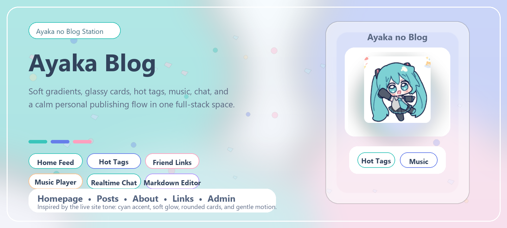

<h1 align="center">
  
  Ayaka Blog
</h1>

<p align="center">
  
</p>

<p align="center">
  <strong>一个带有二次元Miku气质的全栈博客平台，包含柔和渐变、圆角卡片、热门标签、音乐模块、聊天和内容发布流程。</strong>
</p>

<p align="center">
  <a href="./README.md"></a>
  <a href="https://blog.ayakacloud.cn/"></a>
</p>

<p align="center">
  <a href="https://vuejs.org/"></a>
  <a href="https://spring.io/projects/spring-boot"></a>
  <a href="https://www.mysql.com/"></a>
  <a href="https://developer.mozilla.org/en-US/docs/Web/API/WebSockets_API"></a>
  <a href="./LICENSE"></a>
  <a href="./LICENSE"></a>
</p>

<p align="center">
  首页 • 文章 • 热门标签 • 友情链接 • 音乐播放器 • 实时聊天
</p>


## 站点简介

> Ayaka Blog 将 Vue 3 前端、Spring Boot 后端和 MySQL 数据库脚本整合在一个仓库中。它不是一个单纯的文章站模板，而是一套更像“个人小站中枢”的全栈基础：发文、审核、评论、音乐、友链、聊天和多语言支持，都已经有了比较完整的骨架。

## 站点分区

<table>
  <tr>
    <td width="50%" valign="top">
      <strong>首页氛围</strong><br />
      首页文章流、文章详情、标签页、分类页、关于页、搜索索引、友情链接
    </td>
    <td width="50%" valign="top">
      <strong>创作空间</strong><br />
      Markdown 编辑器、文章图片上传、投稿工作台、审核后发布
    </td>
  </tr>
  <tr>
    <td width="50%" valign="top">
      <strong>账号角落</strong><br />
      注册、邮箱验证、登录、刷新令牌、找回密码、会话管理
    </td>
    <td width="50%" valign="top">
      <strong>审核后台</strong><br />
      角色权限控制、文章审核、评论审核、评论举报、驳回、删除、批量处理
    </td>
  </tr>
  <tr>
    <td width="50%" valign="top">
      <strong>社交区域</strong><br />
      实时聊天、好友申请、拉黑、已读状态同步、联系人搜索
    </td>
    <td width="50%" valign="top">
      <strong>扩展模块</strong><br />
      音乐播放列表、媒体上传、可选 Turnstile、人机验证、IP 归属地解析
    </td>
  </tr>
</table>

## 风格方向

<table>
  <tr>
    <td width="50%" valign="top">
      <strong>主强调色</strong><br />
      以站点里的青绿色 <code>#39c5bb</code> 为主视觉点缀
    </td>
    <td width="50%" valign="top">
      <strong>次级渐变</strong><br />
      柔和蓝紫渐变，对应卡片和按钮高光
    </td>
  </tr>
  <tr>
    <td width="50%" valign="top">
      <strong>界面语言</strong><br />
      大圆角、轻玻璃态、留白充足、信息层次柔和
    </td>
    <td width="50%" valign="top">
      <strong>产品气质</strong><br />
      个人感、安静、轻二次元、适合长期扩展
    </td>
  </tr>
</table>

## 技术栈

<table>
  <tr>
    <td width="20%" valign="top"><strong>前端</strong></td>
    <td width="80%" valign="top">Vue 3、Vite 5、Vue Router、Pinia、Vue I18n、Element Plus、md-editor-v3</td>
  </tr>
  <tr>
    <td width="20%" valign="top"><strong>后端</strong></td>
    <td width="80%" valign="top">Spring Boot 3.5、Spring Security、MyBatis-Plus、JWT、WebSocket、Java Mail</td>
  </tr>
  <tr>
    <td width="20%" valign="top"><strong>数据库</strong></td>
    <td width="80%" valign="top">MySQL 8、初始化 SQL、种子数据、手动 SQL 迁移</td>
  </tr>
  <tr>
    <td width="20%" valign="top"><strong>构建工具</strong></td>
    <td width="80%" valign="top">npm、Maven</td>
  </tr>
</table>

## 目录结构

```text
anime-blog/
├─ frontend/      # Vue 3 前端应用
├─ backend/       # Spring Boot API 与 WebSocket 服务
├─ database/      # 建表脚本、初始化数据、迁移脚本
└─ .gitignore
```

## 启动这个小站

### 1. 环境要求

- Node.js 18+
- npm 9+
- JDK 17
- Maven 3.9+
- MySQL 8.0+

### 2. 初始化数据库

按下面顺序执行 SQL 文件：

```text
database/init.sql
database/init_data.sql
database/migration_refresh_token.sql
database/migrations/*.sql
```

初始化数据会创建一个默认站长账号：

- 用户名：`admin`
- 密码：`admin123`

首次登录后请立即修改密码。

### 3. 配置后端环境变量

先复制模板文件：

```bash
cd backend
cp .env.template .env
```

后端至少需要补齐这些配置：

- `DB_HOST`
- `DB_PORT`
- `DB_USERNAME`
- `DB_PASSWORD`
- `MAIL_HOST`
- `MAIL_PORT`
- `MAIL_USERNAME`
- `MAIL_PASSWORD`
- `MAIL_FROM_ADDRESS`
- `ANIME_BLOG_JWT_SECRET`

说明：

- `backend/start.sh` 会自动加载 `.env`。
- 如果你通过 IDE 或 `mvn spring-boot:run` 启动后端，需要先把这些环境变量注入到当前运行进程。

### 4. 启动后端服务

本地开发：

```bash
cd backend
mvn spring-boot:run
```

默认后端地址：

```text
http://localhost:8080
```

如果是 Linux 服务器并且已经打包成 JAR，也可以使用：

```bash
cd backend
./start.sh start
```

### 5. 启动前端站点

```bash
cd frontend
npm install
npm run dev
```

默认前端地址：

```text
http://localhost:5173
```

前端开发服务器会把下面这些路径代理到后端：

- `/api`
- `/uploads`
- `/ws`

### 6. 生产构建

前端构建：

```bash
cd frontend
npm run build
```

后端构建：

```bash
cd backend
mvn clean package
```

## 站点说明

> 后端默认连接的数据库名为 `anime_blog`。  
> 上传文件默认存储在 `APP_UPLOAD_DIR`，默认值为 `./storage/uploads`。  
> `frontend/dist`、`backend/target` 等构建产物已经在 `.gitignore` 中排除。  
> `backend/storage` 被视为运行期数据目录，不会提交到仓库。  
> 本地开发时默认允许 `http://localhost:5173` 访问后端接口。

## 常用文件

<table>
  <tr>
    <td width="34%" valign="top"><code>frontend/package.json</code></td>
    <td width="66%" valign="top">前端脚本命令</td>
  </tr>
  <tr>
    <td width="34%" valign="top"><code>frontend/vite.config.js</code></td>
    <td width="66%" valign="top">开发端口与代理配置</td>
  </tr>
  <tr>
    <td width="34%" valign="top"><code>backend/.env.template</code></td>
    <td width="66%" valign="top">环境变量模板</td>
  </tr>
  <tr>
    <td width="34%" valign="top"><code>backend/start.sh</code></td>
    <td width="66%" valign="top">后端打包部署辅助脚本</td>
  </tr>
  <tr>
    <td width="34%" valign="top"><code>database/init.sql</code></td>
    <td width="66%" valign="top">数据库初始化结构</td>
  </tr>
  <tr>
    <td width="34%" valign="top"><code>database/init_data.sql</code></td>
    <td width="66%" valign="top">数据库种子数据</td>
  </tr>
</table>

## 后续扩展方向

> 这个项目已经具备继续演进的基础，可以继续往这些方向推进。  
> 更完整的内容审核工作流。  
> 更丰富的站点模块和个人页面。  
> 更强的聊天、通知与社交能力。  
> 更完善的生产环境部署方案。  
> 自动化数据库迁移管理。

## License

本项目基于 MIT License 开源，具体内容请参见 [LICENSE](./LICENSE) 文件。
